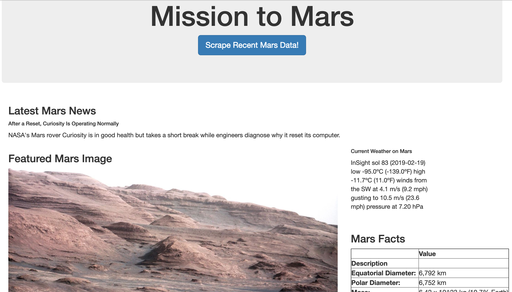

# Mission to Mars

The purpose of this project was to build a web application that scrapes various websites for data related to the Mission to Mars and displays the information in a single HTML page.

## Step 1 - Scraping

Initial scraping was performed using Jupyter Notebook, BeautifulSoup, Pandas, and Requests/Splinter.

* Jupyter Notebook file called `mission_to_mars.ipynb`.

### NASA Mars News

* First, the [NASA Mars News Site](https://mars.nasa.gov/news/) was scraped to collect the latest News Title and Paragraph Text. The scraped text was assigned to variables to be referenced later.

### JPL Mars Space Images - Featured Image

* Next, the JPL Featured Space Image [here](https://www.jpl.nasa.gov/spaceimages/?search=&category=Mars) was scraped to collect the featured image url for the current Featured Mars Imaged and assigned to a variable (`featured_image_url`).

### Mars Weather

* Next, the Mars Weather twitter account [here](https://twitter.com/marswxreport?lang=en) was scraped for the latest Mars weather tweet from the page. The tweet text for the weather report was saved as a variable called `mars_weather`.

### Mars Facts

* Then, the Mars Facts webpage [here](http://space-facts.com/mars/) was scraped to collect the following facts: Equatorial Diameter, Polar Diameter, Mass, Moons, Orbit Distance, Orbit Period, Surface Temperature, First Record, and Records By.

* Pandas was used to convert the data to a HTML table string.

### Mars Hemispheres

* Lastly, the USGS Astrogeology site [here](https://astrogeology.usgs.gov/search/results?q=hemisphere+enhanced&k1=target&v1=Mars) was scraped to obtain high resolution images for each of Mar's hemispheres.

* Both the image url string for the full resolution hemisphere image, and the Hemisphere title containing the hemisphere name were saved and a Python dictionary was used to store the data using the keys `img_url` and `title`.

* The dictionary was appended with the image url string and the hemisphere title to a list. This list contains one dictionary for each hemisphere.

## Step 2 - MongoDB and Flask Application

Using MongoDB with Flask templating a new HTML page was created that displays all of the information that was scraped from the URLs above.

* The Jupyter notebook from above was coverted into a Python script called `scrape_mars.py` with a function called `scrape` that executes all of the scraping code from above and returns one Python dictionary containing all of the scraped data.

* Next, a route called `/scrape` imports the `scrape_mars.py` script and calls the `scrape` function.

  * The returned values are stored in Mongo as a Python dictionary.

* A root route `/` queries the Mongo database and passes the mars data into an HTML template to display the data.

* A template HTML file called `index.html` takes the mars data dictionary and displays all of the data in HTML elements.